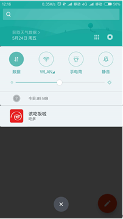
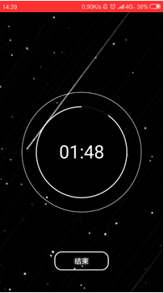
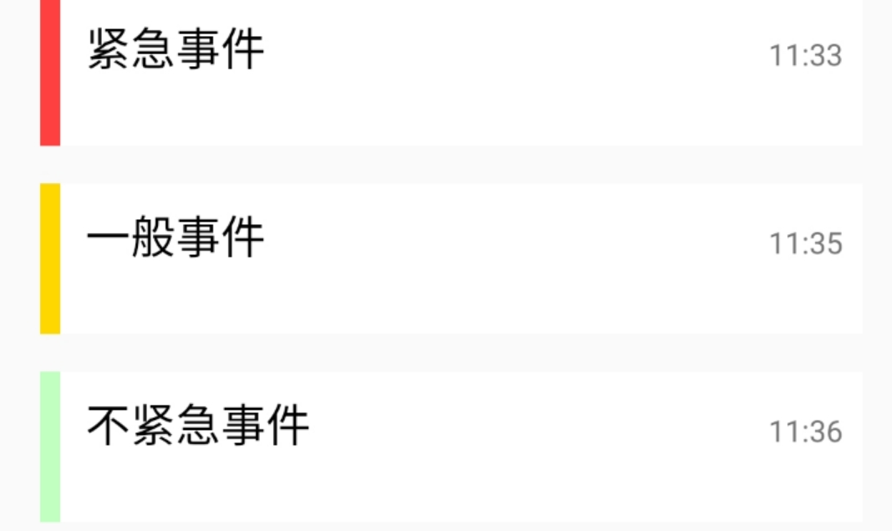
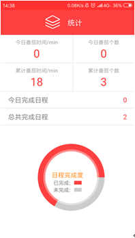
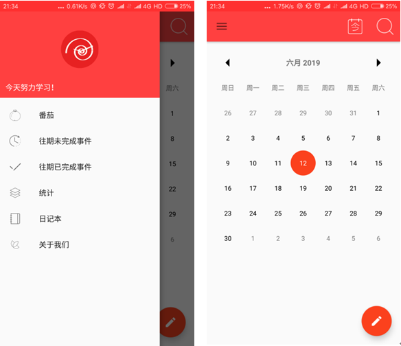

# Mobile-application-of-schedule-management-for-preventing-delay_BC_201903

### Introduce
This software is a schedule management software which helps users to focus, complete tasks efficiently and get rid of procrastination through tomato working method. 

It combines the theoretical results of procrastination in psychology, the four quadrant rule of time management and the tomato work method to help users better control time, prevent procrastination and improve work efficiency.

### Development environment
Development tool: Android studio

Required version of operating system: Android 7.0 and above

Software installation method: use APK installation package to install to Android phone

### Main functions of software
There are a lot of schedule management software on the market, but in order to better help college students manage the schedule, improve efficiency and refuse procrastination. In addition to the perfect basic functions and friendly interaction mode, two key functions are highlighted: Custom tomato clock and schedule mandatory reminder.

#### 1. Schedule mandatory reminder
According to psychology, a kind of mandatory reminder can help users overcome procrastination.

According to the reminder time selected by the user, the system will wake up the broadcast and start the notification service at a fixed time, send out the reminder at a fixed time, and use the circular vibration and reminder tone until the user views the schedule, so as to achieve the determination to help the user prevent delay and consolidate his complete work goal.

#### 2. Custom tomato clock
According to psychology, it is more helpful to focus on efficient work by actively shielding the source of temptation and self defined tomato working method.

Because the tomato working method was originally fixed to focus on learning and work within 25 minutes, but it has been proved that for different people, different concentration results in different concentration time. In order to better let users set the concentration learning time for their own concentration situation, the animation class is specially used to enable users to customize the tomato working method through the touch and slide of their fingers Duration.

#### 3. Distinguish urgency by color scale
According to psychology, it is easier to improve work efficiency by breaking down difficult things.

The four quadrant rule of time management is innovated into the three-color emergency level of schedule management. The distinct three-color level can better distinguish the emergency level of schedule, help users control the emergency level of tasks, and improve the efficiency of accurate task time.

#### 4. Encourage users
Psychology shows that rewards for difficult tasks can help users get rid of procrastination better.

Statistics of schedule completion and tomato time, and according to the length of tomato time, users will be awarded different levels of talent medal to achieve the incentive effect and wake up the lasting work reward.

### Database design
This schedule management software uses the litepal database framework of Android to realize the data element storage management of the whole system.

### Frame construction
MVC mode is adopted as a whole. The view layer is responsible for displaying, the data model layer is responsible for storing the schedule and other element data, and the logic control layer realizes the interaction from the view layer to the data model layer. Both the view layer and the data model layer implement interfaces for the logical control layer to call and process

### Main interface display

